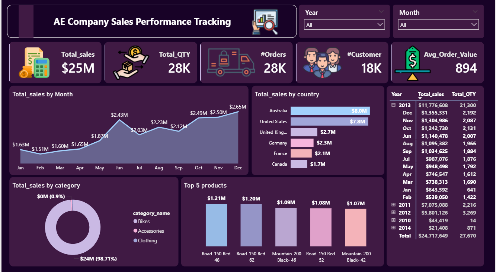
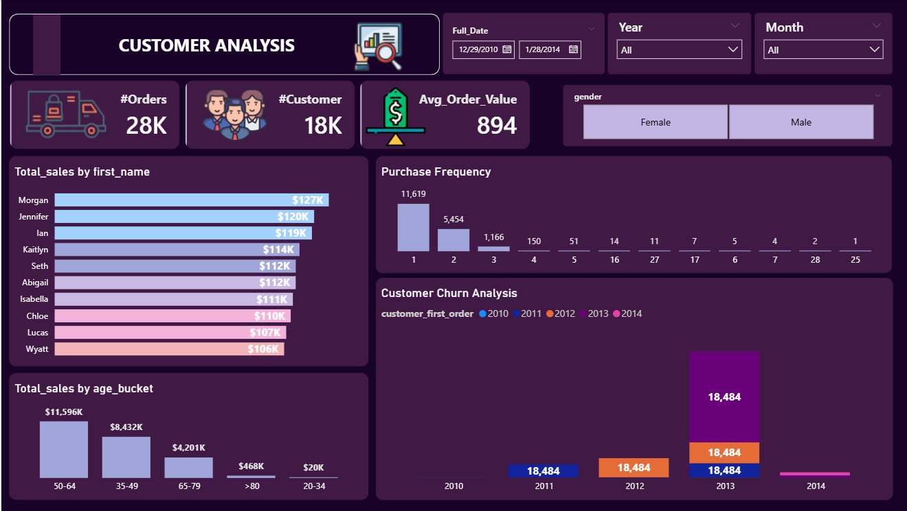

# AE Company Sales and Customer Analysis Dashboard

## Project Overview
This project involved building a comprehensive end to end Power BI dashboard for AE Company to track sales performance and analyze customer behavior. The goal was to transform raw sales data into actionable insights to help the management make data driven decisions regarding inventory and marketing strategies.

## Data Engineering and Modeling
* **Data Cleaning**: Used Power Query to handle missing values, remove duplicates, and ensure data types consistency.
* **Data Modeling**: Implemented a Star Schema consisting of a Fact Sales table and Dimension tables for Customers, Products, and a custom created Date table.
* **DAX Calculations**: Developed custom Measures for key performance indicators including Revenue, Average Order Value (AOV), Total Quantity, and Purchase Frequency.

## Dashboard Preview

## Key Insights and Analysis
1. **Sales Performance**: Total revenue reached 25 Million dollars with 28 Thousand orders.
2. **Product Analytics**: The Bikes category dominates the revenue share at over 98 percent.
3. **Customer Behavior**: Identified loyalty levels by analyzing purchase frequency and implemented a Cohort Analysis to track long term loyalty trends.
4. **Demographics**: Sales are highest in the 50 to 64 age group, with Australia and the USA being the leading markets.

## How to use
1. Download the `AE_Company_Dashboard.pbix` file.
2. Open it using Power BI Desktop.
